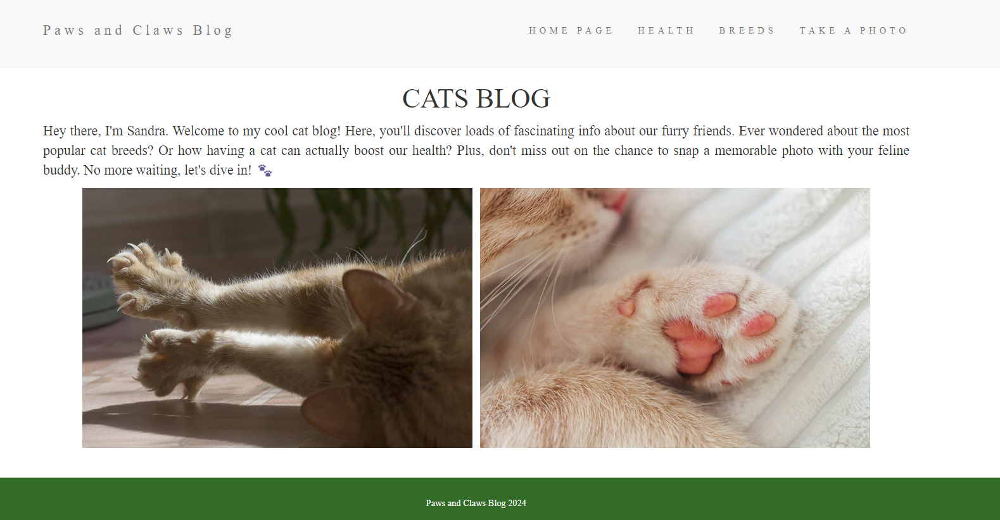

# Projekt – Strona Webowa z wykorzystaniem HTML, CSS, JavaScript

## Cel:
Celem projektu było stworzenie strony internetowej obsługującej modyfikacje multimediów, skoncentrowanej głównie na tematyce dotyczącej kotów.

## Narzędzia:
- HTML
- CSS
- JavaScript
- Visual Studio Code

## Opis:
Strona internetowa nosi tytuł "Paws and Claws Blog" i jest blogiem poświęconym kotom. Projekt wykorzystuje szablony EJS (Embedded JavaScript) do renderowania widoków. Strona główna zawiera krótki wstęp, a następnie prezentuje trzy główne sekcje:

1. **HEALTH**: Ta sekcja prezentuje naukowe fakty związane z posiadaniem zwierzaka w domu oraz naszym zdrowiem.
2. **BREED**: W tej sekcji znajdują się różne rasy kotów. Po kliknięciu na zdjęcie rasy użytkownik przenoszony jest do dłuższego artykułu dotyczącego danej rasy.
3. **TAKE A PHOTO**: Ostatnia sekcja umożliwia użytkownikowi zrobienie sobie zdjęcia z wygenerowanym napisem oraz pobranie zrobionego zdjęcia. W przyszłości planowane jest dodanie możliwości nagrywania dźwięku na stronie.

Projekt jest ciągle rozwijany, aby zapewnić nowe funkcjonalności i lepsze doświadczenia użytkownikom odwiedzającym stronę.

## Prezentacja Strony Web:
1. 
2. 
3. 
4. 
5. 
